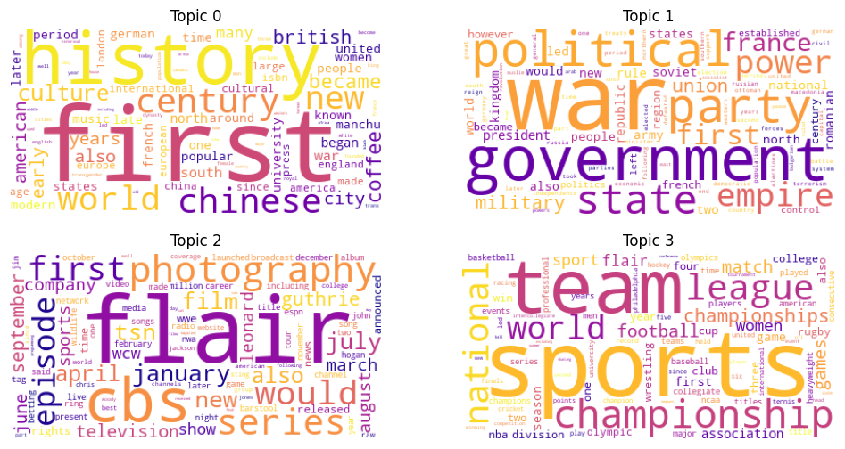

# LDA Topic Modeling with Stochastic Variational Inference

This project implements the **Stochastic Variational Inference (SVI)** algorithm for **Latent Dirichlet Allocation (LDA)**, based on the foundational paper:

> **Hoffman, M. D., Blei, D. M., Wang, C., & Paisley, J. (2013)**. *Stochastic Variational Inference*. Journal of Machine Learning Research.

While the article proposes a general framework for scalable variational inference, **this project focuses specifically on the application of SVI to topic modeling using LDA**.

The algorithm is implemented from scratch in Python and applied to a custom corpus of **Wikipedia articles** to uncover latent thematic structures.

---

## Project Structure

```
.
├── data/
│   └── wikipedia_corpus.json        # Extracted and cleaned Wikipedia articles
├── images/
│   ├── barplot.png                  # Topics per seed
│   ├── piechart.png                 # Topic frequency
│   └── wordclouds.png               # Top words per topic
├── src/
│   ├── __init__.py                  # Declares src as a package
│   ├── data_extraction.py           # Wikipedia scraping from seeds
│   ├── data_preparation.py          # Tokenization and BOW vectorization
│   ├── utils.py                     # Evaluation + visualization helpers
├── lda_svi_report.ipynb             # Main report notebook (theoretical + code)
├── requirements.txt
└── README.md
```

---

## Setup & Installation

1. Clone the repository:
```bash
git clone https://github.com/your-username/svi-lda-topic-modeling.git
cd svi-lda-topic-modeling
```

2. Create and activate a virtual environment:
```bash
python3 -m venv venv
source venv/bin/activate
```

3. Install the required dependencies:
```bash
pip install -r requirements.txt
```

Main dependencies:
- numpy, pandas, nltk
- matplotlib, plotly, wordcloud

---

## How to Use

1. (Optional) Regenerate a corpus from Wikipedia seeds:
```bash
python src/data_extraction.py
```

2. Launch the notebook:
```bash
jupyter notebook lda_svi_report.ipynb
```

3. In the notebook:
   - Load and vectorize the dataset
   - Run the custom SVI algorithm for LDA
   - Visualize the results (topic distributions, word clouds)

---

## Sample Outputs

### Top Words per Topic
Most probable words extracted from the topic-word distribution matrix $\lambda$.

### Word Clouds
Visual representation of dominant words in each topic:



### Topic Frequency
Distribution of the most dominant topics across the corpus:


### Topics per Seed
How discovered topics are distributed by thematic seeds:


---

## Notes

- The dataset includes approximately 1200 articles extracted from 8 Wikipedia seed terms:
  `["business", "culture", "history", "internet", "language", "nature", "politics", "sports"]`
- SVI hyperparameters used in training:
  - Number of topics: $K = 10$
  - Dirichlet priors: $\alpha = \eta = 1.0$
  - Learning schedule: $\tau = 100$, $\kappa = 0.7$
  - Training: 500 iterations

---

## About

This project was developed for the M2 master's course **"Méthodes de simulation pour les modèles génératifs"**, taught by **Sylvain Le Corff**.

Course GitHub: [https://github.com/sylvainlc/22-generative_models](https://github.com/sylvainlc/22-generative_models)

---
